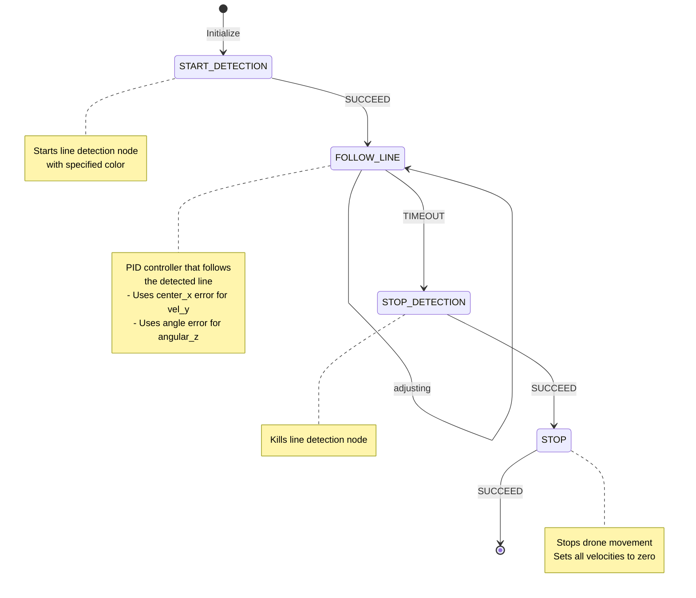

```mermaid
stateDiagram-v2
    [*] --> START_DETECTION: Initialize
    START_DETECTION --> FOLLOW_LINE: SUCCEED
    FOLLOW_LINE --> FOLLOW_LINE: adjusting
    FOLLOW_LINE --> STOP_DETECTION: TIMEOUT
    STOP_DETECTION --> STOP: SUCCEED
    STOP --> [*]: SUCCEED
    
    note right of START_DETECTION
        Starts line detection node
        with specified color
    end note
    
    note right of FOLLOW_LINE
        PID controller that follows
        the detected line
        - Uses center_x error for vel_y
        - Uses angle error for angular_z
    end note
    
    note right of STOP_DETECTION
        Kills line detection node
    end note
    
    note right of STOP
        Stops drone movement
        Sets all velocities to zero
    end note
```
