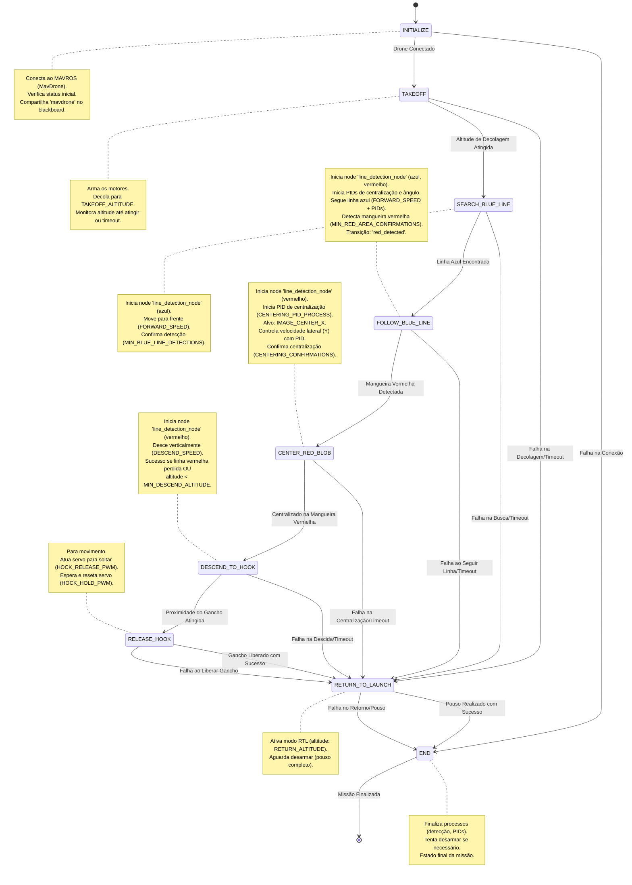

# Pacote Hook - Missão 2 (M2): "Hang the Hook"

Este pacote implementa a lógica de controle para a Missão 2 da competição SAE Aerodesign Eletroquad, utilizando uma Máquina de Estados Finitos (FSM) baseada na biblioteca YASMIN.

## Descrição da Missão
O objetivo desta missão é decolar transportando um gancho e realizar a colocação ou soltura deste gancho de forma que ele fique preso, por gravidade, a uma mangueira vermelha com 12.7 mm de diâmetro, representando uma linha de transmissão, erguida a 2 metros de altura. O veículo deverá decolar de uma base quadrada no solo contendo um círculo azul e localizar uma mangueira vermelha na qual o gancho deverá ser pendurado. Ao realizar a soltura, o veículo deverá voltar e pousar na base de onde decolou. Para auxiliar na localização da mangueira vermelha, o drone poderá (sem obrigatoriedade) seguir uma linha azul no solo, com 25 cm de espessura.

Cada equipe é responsável pela fabricação do gancho e o desenvolvimento de um mecanismo para segurar e liberar este gancho. O gancho deve ser rígido, e o mecanismo deve garantir a imobilidade relativa entre o gancho e a aeronave durante o voo. Quando acoplado ao mecanismo de soltura da aeronave, o gancho não deve tocar o solo. Além disso, o conjunto formado pelo gancho e o airframe, incluindo o trem de pouso, deve estar inteiramente contido em um círculo de 530 mm de diâmetro quando visto de cima. Ao realizar o pouso, o veículo deve desligar todos os rotores.

## Implementação

A lógica da missão é orquestrada por uma Máquina de Estados Finitos (FSM) implementada com a biblioteca [YASMIN](https://github.com/uleroboticsgroup/yasmin). O ponto de entrada principal é o script `hook/hook/states/hang_the_hook_sm.py`, que define a sequência de estados e transições.

Cada estado representa uma fase da missão (ex: decolagem, busca da linha, centralização, etc.) e encapsula a lógica específica usando principalmente a `Mirela SDK` para controle do drone (via MAVROS) e processamento de visão (detecção de linhas e blobs). Controladores PID são utilizados para tarefas de navegação como seguir a linha e centralizar sobre alvos.

O fluxo geral da máquina de estados é visualizado abaixo:



## Estrutura do Diretório

-   `hook/`: Contém o código Python principal do pacote.
    -   `hook/states/`: Define a máquina de estados principal (`hang_the_hook_sm.py`) e as classes de estado individuais.
        -   `hook/states/line_following/`: Estados relacionados ao seguimento da linha azul.
        -   `hook/states/hook_operations/`: Estados relacionados à centralização, descida e liberação do gancho.
        -   `basic_states.py`: Estados básicos como Initialize, Takeoff, RTL, End.
        -   `constants.py`: Constantes usadas nos estados (altitudes, velocidades, parâmetros PID, etc.).
-   `resource/`: Arquivos de recurso, como o marcador de pacote ament.
-   `test/`: Testes unitários ou de integração (se houver).
-   `package.xml`: Metadados do pacote ROS 2, incluindo dependências.
-   `setup.py`: Script de build para pacotes Python ament.
-   `setup.cfg`: Configuração para o setup.py.
-   `README.md`: Este arquivo.

## Pré-requisitos

-   ROS 2 (Recomendado: Humble Hawksbill)
-   [YASMIN](https://github.com/uleroboticsgroup/yasmin) (Biblioteca de Máquina de Estados)
-   [Mirela SDK](https://github.com/Black-Bee-Drones/mirela-sdk) (Biblioteca interna de controle e visão)
-   [PID Controller](https://github.com/Black-Bee-Drones/pid-controller) (Biblioteca interna de controle PID)

## Instalação

1.  **Instalar YASMIN:**
    ```bash
    # Substitua $ROS_DISTRO pela sua versão do ROS 2 (ex: humble)
    sudo apt update
    sudo apt install ros-$ROS_DISTRO-yasmin ros-$ROS_DISTRO-yasmin-*
    ```
    *(Consulte a [documentação oficial do YASMIN](https://github.com/uleroboticsgroup/yasmin?tab=readme-ov-file#installation) para mais detalhes)*

2.  **Clonar o Repositório:**
    Navegue até o diretório `src` do seu workspace ROS 2 (ex: `~/ros2_ws/src`) e clone este repositório:
    ```bash
    git clone https://github.com/Black-Bee-Drones/SAE-Eletroquad.git
    ```

3.  **Instalar Dependências:**
    Navegue até a raiz do seu workspace (ex: `~/ros2_ws`) e instale as dependências listadas nos `package.xml` dos pacotes:
    ```bash
    cd ~/ros2_ws # Ou o diretório raiz do seu workspace
    rosdep install --from-paths src --ignore-src -r -y
    ```

## Build

Navegue até a raiz do seu workspace e compile o pacote `hook`:

```bash
cd ~/ros2_ws # Ou o diretório raiz do seu workspace
colcon build --packages-select hook
```

## Execução

1.  **Abra um novo terminal.**
2.  **Faça o source do setup do seu workspace:**
    ```bash
    source ~/ros2_ws/install/setup.bash
    ```
3.  **Execute a máquina de estados principal:**
    ```bash
    ros2 run hook hang_the_hook_sm
    ```

4.  **(Opcional) Visualizar a Máquina de Estados:**
    Enquanto a máquina de estados está rodando, você pode visualizá-la em tempo real usando o `yasmin-viewer`. Abra outro terminal, faça o source novamente e execute:
    ```bash
    ros2 run yasmin_viewer yasmin_viewer_node
    ```
    Acesse `http://localhost:5000` (ou o endereço/porta configurado) no seu navegador.
