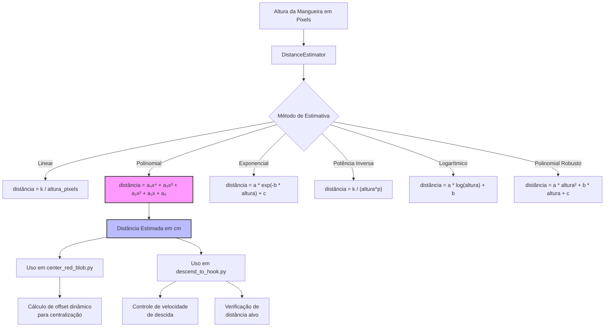

# Métodos de Estimativa de Distância

Este documento descreve os métodos de estimativa de distância implementados para a missão "Hang the Hook", que são utilizados para calcular a distância entre o drone e a mangueira vermelha durante as fases de centralização e descida.

## Visão Geral

A estimativa de distância é um componente crítico para o sucesso da missão, pois permite que o drone:
1. Determine sua distância atual em relação à mangueira vermelha
2. Desça com precisão até a altura ideal para soltar o gancho
3. Mantenha uma centralização adequada durante a descida

O sistema utiliza a altura em pixels da mangueira vermelha na imagem da câmera para estimar a distância real em centímetros.



## Métodos de Estimativa Implementados

A classe `DistanceEstimator` implementa vários métodos de estimativa, cada um com suas próprias características:

### 1. Modelo Linear (Inverso)
- **Fórmula**: `distância = k / altura_pixels`
- **Parâmetros**: `k = 2150.0`
- **Descrição**: Modelo mais simples baseado na relação inversa entre distância e tamanho aparente.

### 2. Modelo Polinomial
- **Fórmula**: `distância = a₄x⁴ + a₃x³ + a₂x² + a₁x + a₀`
- **Parâmetros**: Coeficientes armazenados em `DISTANCE_POLY_COEFFS`
- **Descrição**: Ajuste polinomial que oferece maior precisão em diferentes faixas de distância.

### 3. Modelo Exponencial
- **Fórmula**: `distância = a * exp(-b * altura) + c`
- **Parâmetros**: `a = 764.06`, `b = 0.1087`, `c = 24.79`
- **Descrição**: Modelo que captura o comportamento exponencial da relação distância-altura.

### 4. Modelo de Potência Inversa
- **Fórmula**: `distância = k / (altura^p)`
- **Parâmetros**: `k = 10000.0`, `p = 1.5004`
- **Descrição**: Generalização do modelo linear inverso com expoente ajustável.

### 5. Modelo Logarítmico
- **Fórmula**: `distância = a * log(altura) + b`
- **Parâmetros**: `a = -173.67`, `b = 637.48`
- **Descrição**: Modelo baseado em função logarítmica.

### 6. Modelo Polinomial Robusto (Grau 2)
- **Fórmula**: `distância = a * altura² + b * altura + c`
- **Parâmetros**: `a = 0.39`, `b = -25.63`, `c = 234.17`
- **Descrição**: Modelo polinomial de segundo grau ajustado com técnica robusta (Huber) para reduzir influência de outliers.

## Método Utilizado na Implementação Atual

Atualmente, o sistema utiliza o **Modelo Polinomial** como método padrão para estimativa de distância, tanto em `center_red_blob.py` quanto em `descend_to_hook.py`. Este modelo foi escolhido por apresentar o melhor equilíbrio entre precisão e estabilidade, com base em análises comparativas dos diferentes modelos.

### Uso em `center_red_blob.py`

```python
# Trecho de código de center_red_blob.py
distance_cm = self.distance_estimator.estimate_distance(msg.height)
distance_m = distance_cm / 100.0

# Calcula offset dinâmico com base na distância
offset_px = ImageCalculus.calculate_offset_pixels(0.089, distance_m, 43.3, 480)
self.center_setpoint = IMAGE_CENTER_Y + offset_px
```

Neste trecho, a altura da mangueira em pixels (`msg.height`) é usada para estimar a distância. Esta distância é então utilizada para calcular um offset dinâmico para o ponto de centralização, compensando a perspectiva da câmera.

### Uso em `descend_to_hook.py`

```python
# Trecho de código de descend_to_hook.py
current_dist_cm = self.distance_estimator.estimate_distance(self.hose_height)
distance_m = current_dist_cm / 100.0

# Verifica condição de sucesso
dist_error = current_dist_cm - TARGET_DISTANCE_CM
if abs(dist_error) <= DISTANCE_TOLERANCE_CM:
    # Atingiu a distância alvo
    return SUCCEED

# Calcula velocidade de descida proporcional ao erro de distância
vz = -DESCEND_KP_Z * dist_error
```

Em `descend_to_hook.py`, a estimativa de distância é utilizada para:
1. Determinar quando o drone atingiu a distância alvo (`TARGET_DISTANCE_CM = 60cm`)
2. Controlar a velocidade de descida proporcionalmente ao erro de distância
3. Ajustar a centralização lateral e longitudinal durante a descida

## Calibração e Parâmetros

Os parâmetros dos modelos foram obtidos através de um processo de calibração que envolveu:
1. Coleta de dados de altura em pixels vs. distância real conhecida
2. Ajuste de diferentes modelos matemáticos aos dados
3. Comparação dos modelos usando métricas como RMSE, R², e AIC
4. Seleção do modelo com melhor desempenho

Os parâmetros calibrados são armazenados no arquivo `distance_parameters.py` e carregados automaticamente pelo `DistanceEstimator`.

## Limitações e Considerações

- A precisão da estimativa depende da qualidade da detecção da mangueira vermelha
- O sistema funciona melhor na faixa de altura entre 15-35 pixels
- Fatores como iluminação e ângulo de visão podem afetar a precisão
- O modelo atual tem uma tolerância de ±3cm na distância alvo

## Conclusão

O sistema de estimativa de distância é um componente essencial para o sucesso da missão "Hang the Hook", permitindo que o drone determine com precisão sua posição em relação à mangueira vermelha e execute a descida e liberação do gancho de forma controlada e precisa. 